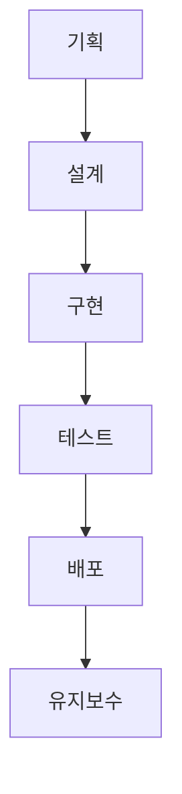

프론트엔드 개발을 하다 보면 “요구사항이 또 바뀌었어요”, “배포 직전에 에러가 터졌어요” 같은 말을 자주 듣게 됩니다.

이런 혼란을 줄이기 위해 **소프트웨어 개발 수명 주기 (SDLC: Software Development Life Cycle)** 개념이 등장했습니다.

SDLC를 프론트엔드 관점에서 구체적인 예시와 함께 정리해보겠습니다. 이 글은 프론트엔드 개발자가 잘하는 방법을 찾기 위한 시리즈의 첫 번째 글입니다.

⸻

## SDLC란?

**SDLC(System Development Life Cycle)**는 시스템을 기획부터 유지보수까지 일련의 단계로 나눠 체계적으로 관리하는 개발 프로세스입니다.

보통 아래 순서로 진행됩니다.

프론트엔드 프로젝트도 이 주기를 통해 “기획에서 운영까지” 한눈에 관리할 수 있습니다.

각 단계가 명확할수록 프로젝트 전체 품질과 예측 가능성이 높아지고, 팀 간 커뮤니케이션도 훨씬 수월해집니다.

⸻

## 프론트엔드 개발자의 SDLC 6단계

### 1️⃣ 기획 / 요구사항 분석

이 단계에서는 **무엇을, 왜, 누구를 위해 만들지**를 명확히 정의합니다.

**프론트엔드 예시**

- "대시보드에 어떤 데이터를 시각화할까?"
- "모바일 퍼스트로 갈까, 데스크탑 중심으로 갈까?"
- "접근성이나 성능 목표를 어디까지 잡을까?"

API 명세를 검토하며 필요한 데이터와 응답 구조를 미리 협의하는 것도 이 단계에서 이루어집니다.
물론 이 단계에서 모든 것을 결정할 수 없습니다. 이후 단계에서 수정될 수 있습니다.

**좋은 기획은 이후의 혼란을 줄여줍니다.**

⸻

### 2️⃣ 설계 (Design)

기획을 코드로 옮기기 전에 **"어떻게 구현할 것인가"**를 설계합니다.

**프론트엔드 예시**

- React + TypeScript 구조 설계
- 상태 관리 (Redux, Zustand, react-query 등) 선택
- 컴포넌트 아키텍처 정의
- CSS 전략: Tailwind, Styled-components, CSS-in-JS 등
- API 인터페이스 설계 (fetch, axios 인터셉터, 에러 핸들링 등)

이 설계가 잘 되어 있으면 프로젝트 규모가 커져도 유지보수가 훨씬 쉬워집니다.

⸻

### 3️⃣ 구현 (Implementation)

이제 실제 코드를 작성하는 단계입니다.

**프론트엔드 예시**

- Form 컴포넌트에서 입력 검증, API 연동, 에러 표시 구현
- Dashboard에서 차트, 필터, 페이지네이션 기능 구성
- 반응형 대응, 접근성(ARIA) 처리, 브라우저 호환성 점검

설계 없이 바로 코딩을 시작하면, 유지보수가 어려워질 수 있습니다.
필요하다면, 리팩토링을 통해 코드를 개선할 수 있습니다.

⸻

### 4️⃣ 테스트 (Testing)

완성된 기능이 제대로 동작하는지 검증하는 단계입니다.

**프론트엔드 예시**

- 단위 테스트: vitest + RTL로 컴포넌트/함수 테스트
- E2E 테스트: Playwright로 실제 사용자 흐름 점검
- 수동 테스트: 다양한 해상도, 브라우저, 접근성 체크
- 성능 테스트: 번들 사이즈, 렌더링 속도, lazy-loading 확인

테스트는 **“버그 없는 코드”**보다 **“예측 가능한 코드”**를 만드는 과정입니다.
작은 변경에도 동작이 유지된다는 확신을 줍니다.

⸻

### 5️⃣ 배포 (Deployment)

사용자가 실제로 접근할 수 있도록 코드를 배포하는 단계입니다.

**프론트엔드 예시**

- 정적 빌드 후 CDN, CloudFront, Vercel, Netlify 등 배포
- 환경 변수 관리 (.env.production, API Key 분리)
- GitHub Actions / GitLab CI 등으로 자동화된 CI/CD 파이프라인 구축
- 버전 관리 및 롤백 전략 준비

잘 구축된 배포 자동화는 추후 유지보수에 도움이 됩니다.

⸻

### 6️⃣ 유지보수 / 운영 (Maintenance)

배포가 끝이 아니라 **시작**입니다.

특히 프론트엔드에서는 브라우저 정책 변경, 서드파티 SDK 업데이트, 디자인 시스템 개편 등 외부 요인으로 인해 유지보수 작업이 자주 발생합니다.
이를 대비해 코드 스플리팅, 모듈화, 문서화를 꾸준히 해두는 게 중요합니다.

**프론트엔드 예시**

- 버그 수정 및 UI 개선
- React 버전 업데이트 및 리팩토링
- 성능 모니터링 (Lighthouse, Sentry, Web Vitals)
- A/B 테스트, Feature Flag로 기능 점진적 릴리스

SDLC의 완성은 **"지속 가능한 코드"**입니다.

⸻

## 프론트엔드에서 SDLC가 중요한 이유

### 1. 요구사항 변경이 잦다

- 체계적 프로세스 없이는 빠르게 망가질 수 있습니다.

### 2. 사용자 경험(UX)이 직접적입니다.

- 테스트, 접근성, 성능 등 품질 관리가 핵심입니다.

### 3. 협업이 많다

→ 기획·디자인·백엔드와의 인터페이스를 명확히 해야 한다.

짧은 주기로 피드백을 받고 개선하는 방식이 효율적입니다.

⸻

## 예시: To-Do 앱을 SDLC로 개발한다면?

| 단계         | 내용                                        |
| ------------ | ------------------------------------------- |
| **기획**     | 사용자 플로우 정의 (추가, 완료, 삭제, 필터) |
| **설계**     | React + Zustand + Tailwind 구조 설계        |
| **구현**     | 컴포넌트 제작, 상태관리, 반응형 UI 개발     |
| **테스트**   | vitest 단위 테스트 + Playwright E2E 테스트  |
| **배포**     | GitHub Actions + Vercel 자동 배포           |
| **유지보수** | 버그 수정, 성능 개선, UX 피드백 반영        |

짧고 반복적인 주기로 개선해 나가면 **"빠른 피드백 → 빠른 성장"**의 선순환이 만들어집니다.

⸻

## 마무리

프론트엔드 개발은 단순히 **"보이는 걸 만드는 일"**이 아니라

기획부터 배포·운영까지 전체 흐름을 설계하고 관리하는 일입니다.

SDLC를 의식적으로 적용하면,

- 프로젝트는 더 명확하고
- 협업은 더 원활하고
- 결과물은 더 안정적이 됩니다.

결국 SDLC는 **"잘 만드는 법"**이 아니라 **"지속적으로 잘 유지하는 법"**입니다.
